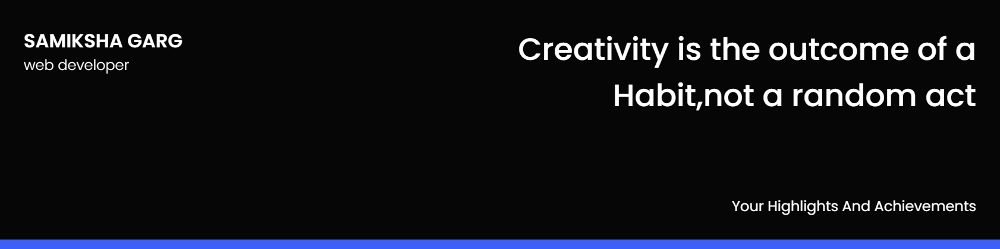

##

### Hi there 
###  A little more about me...

- 🔭 I’m currently a Student at Thapar Institute of Engineering & Technology, Patiala

- 🥇 I was a top contributor at ISTE - Code Debugging Challenge

- 🌱 I’m currently learning ReactJs

- ⚡ Fun fact: I am Learning to play the guitar with zero singing skills

- 📫 Contact me **[here](samikshagarg321@gmail.com)**

## ✍ My Work

## 👩‍💻 Languages and Tools

 
<!--
## 👩‍💻 Languages and Tools
 &nbsp;  &nbsp;  &nbsp;  &nbsp;  &nbsp;  
-->
## 🤝 let's Connect

